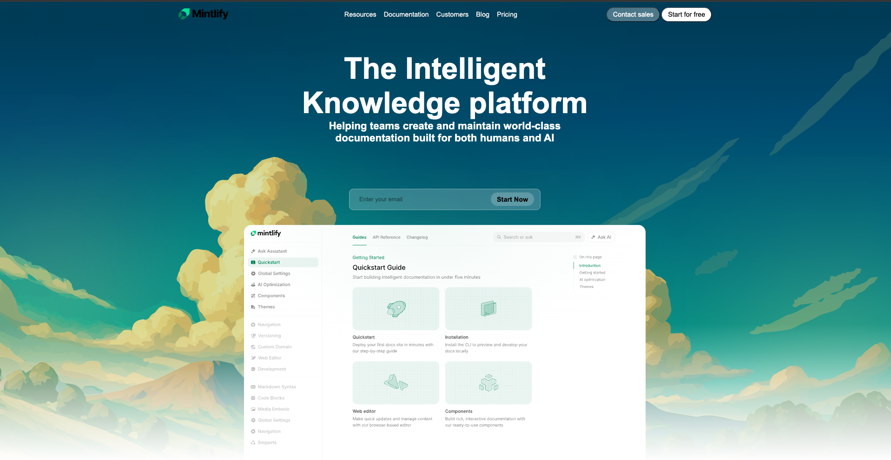
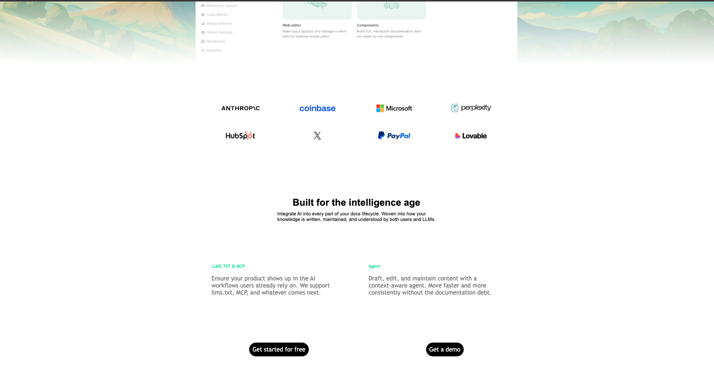
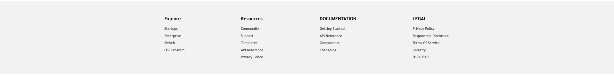

NavBar and Main

Companies name

Footer Section

SETUP/GUIDE TO DOWNLOAD AND RUN THE PROJECT

Step 1:
  -> Visit:- https://github.com/root-anshul/mintlify_docs
  -> Click on Code then click on "Download zip" 

Step 2:
  -> Github will download a zip file named "mintlify_docs.zip" you need to extract it 

Step 3:
  -> Import the folder named "anshul_potfolio-main" in  VS code or any other supported IDE

Step 4:
  -> Install the Live Preview extension from Extensions
  -> Open the file name Portfolio.html right click -> open with live server